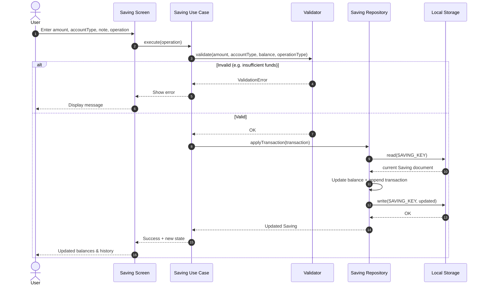
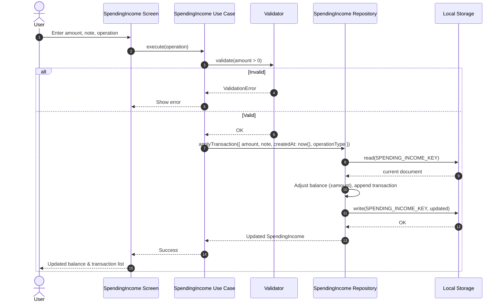
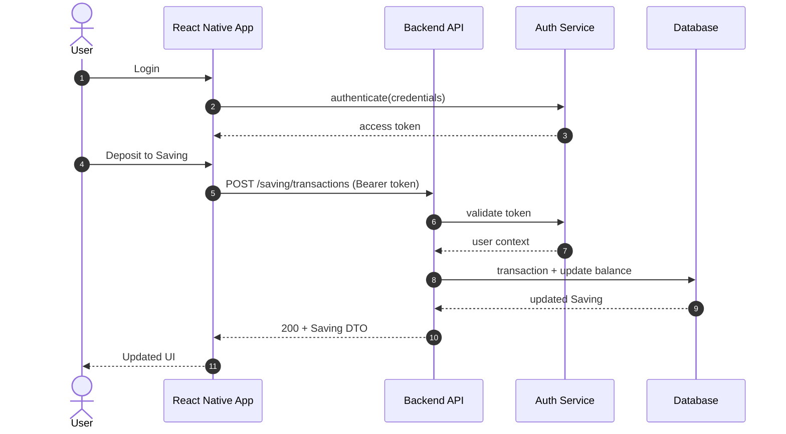

# Vault Track — Flow Diagrams

Sequence diagrams for core application flows. See `BRD.md` for business rules and `Implementation.md` for build plan.

---

## 1. Saving — Deposit / Withdraw



### Flow Summary

| Step | Actor | Action |
|------|-------|--------|
| 1 | User | Submits deposit or withdraw with amount, account type, and note |
| 2 | Validator | Checks positive amount and sufficient balance for withdraw |
| 3 | Repository | Reads current Saving, updates balance, appends transaction |
| 4 | Storage | Persists updated document atomically |
| 5 | UI | Reflects new balances and transaction history |

---

## 2. SpendingIncome — Deposit / Withdraw



### Flow Summary

| Step | Actor | Action |
|------|-------|--------|
| 1 | User | Submits income (deposit) or spending (withdraw) |
| 2 | Validator | Ensures amount is positive |
| 3 | Repository | Adjusts signed balance and appends transaction with `createdAt` |
| 4 | Storage | Persists updated SpendingIncome document |
| 5 | UI | Shows updated balance and period transaction list |

---

## 3. SpendingIncome — Reset (Archive + Fresh Period)

```mermaid
sequenceDiagram
    autonumber
    actor User
    participant UI as SpendingIncome Screen
    participant UC as Reset Use Case
    participant Repo as SpendingIncome Repository
    participant Archive as Archive Service
    participant FS as File System
    participant Store as Local Storage

    User->>UI: Confirm reset
    UI->>UC: resetPeriod()
    UC->>Repo: getCurrent()
    Repo->>Store: read(SPENDING_INCOME_KEY)
    Store-->>Repo: active SpendingIncome
    Repo-->>UC: current period

    UC->>UC: snapshot = clone(current)
    UC->>UC: snapshot.resetedAt = now()

    UC->>Archive: save(snapshot)
    Archive->>FS: write(JSON file with timestamp)
    FS-->>Archive: file path
    Archive-->>UC: archive reference

    UC->>Repo: replaceWithFresh({ startedAt: now(), resetedAt: null, balance: 0, transactions: [] })
    Repo->>Store: write(SPENDING_INCOME_KEY, fresh)
    Store-->>Repo: OK
    Repo-->>UC: new period

    UC-->>UI: Reset complete
    UI-->>User: Fresh period shown; optional archive link
```

### Flow Summary

| Step | Actor | Action |
|------|-------|--------|
| 1 | User | Confirms reset of current SpendingIncome period |
| 2 | Use Case | Clones current period and sets `resetedAt` to now |
| 3 | Archive Service | Writes full snapshot to a timestamped JSON file |
| 4 | Repository | Replaces active document with fresh period (`balance: 0`, empty transactions) |
| 5 | UI | Displays new period with `startedAt = now` |

---

## 4. Future Phase — Mobile + Server (Target Architecture)



### Flow Summary

| Step | Actor | Action |
|------|-------|--------|
| 1 | User | Authenticates via mobile app |
| 2 | App | Sends API requests with bearer token |
| 3 | API | Validates auth and applies business logic server-side |
| 4 | Database | Persists authoritative state |
| 5 | App | Renders server response as UI state |

---

## 5. High-Level System Context

```
┌─────────────────────────────────────┐
│  React Native Mobile App (Phase 1)  │
│  - Saving UI                        │
│  - SpendingIncome UI                │
│  - Local storage                    │
└──────────────┬──────────────────────┘
               │  (Phase 2 — future)
               ▼
┌─────────────────────────────────────┐
│  Backend + Auth                     │
│  - API for CRUD + reset/archive     │
│  - User authentication              │
└──────────────┬──────────────────────┘
               │
               ▼
┌─────────────────────────────────────┐
│  Persistence                        │
│  - Saving & SpendingIncome docs     │
│  - Archived JSON on reset           │
└─────────────────────────────────────┘
```
